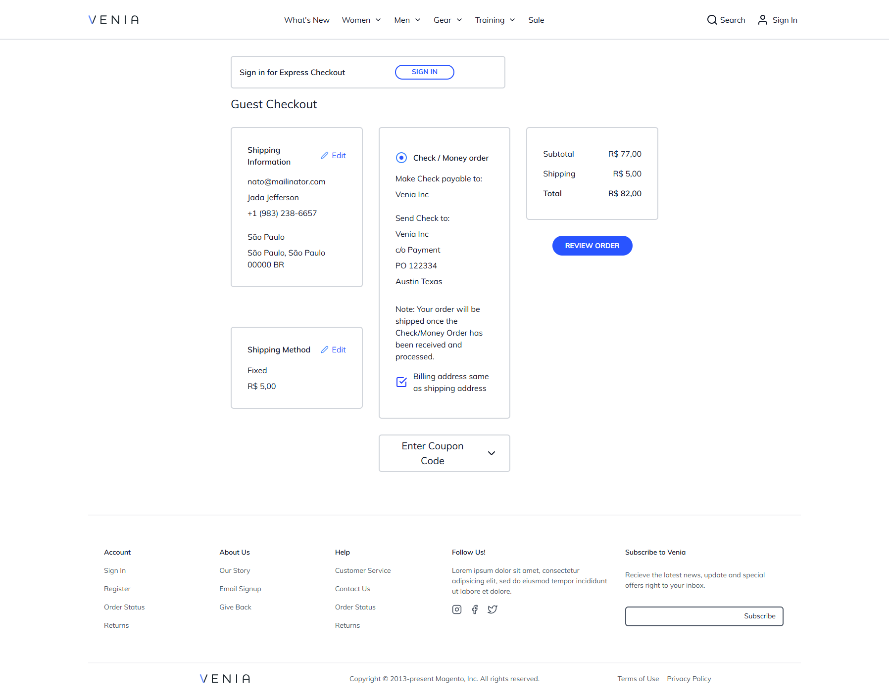
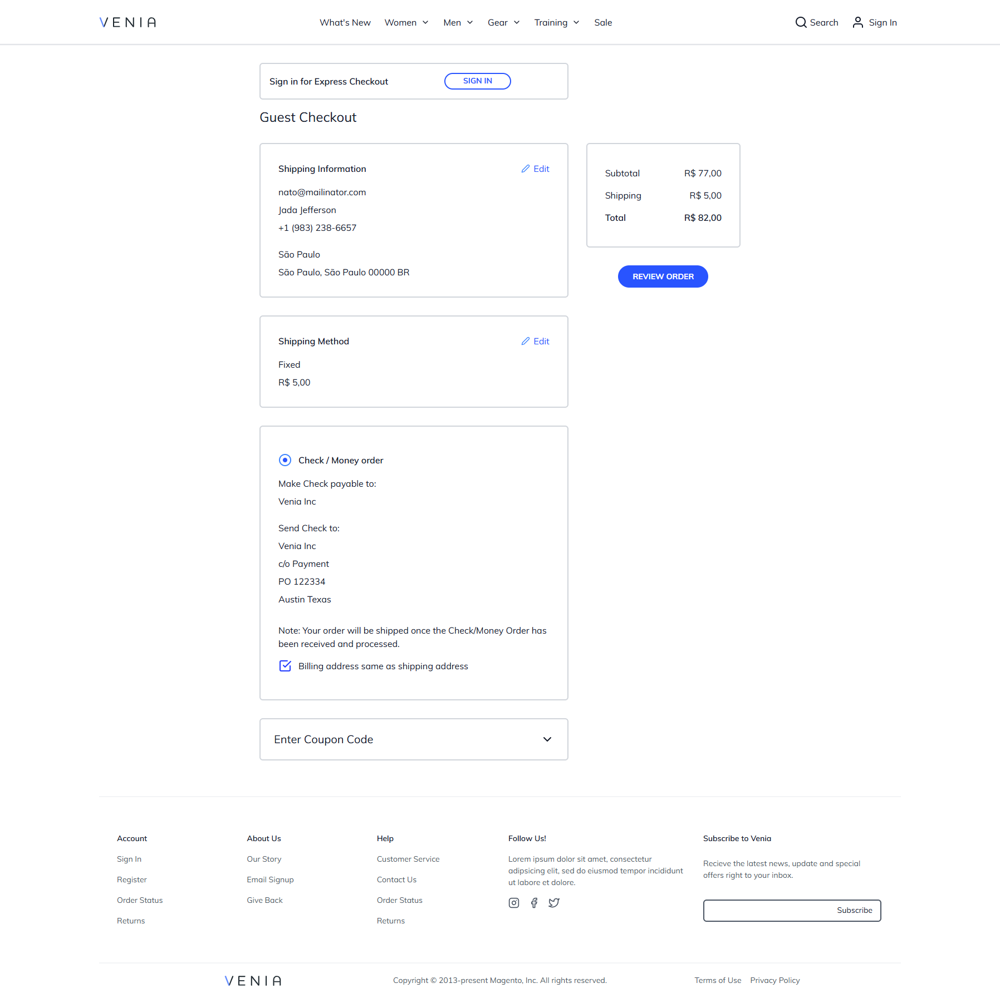
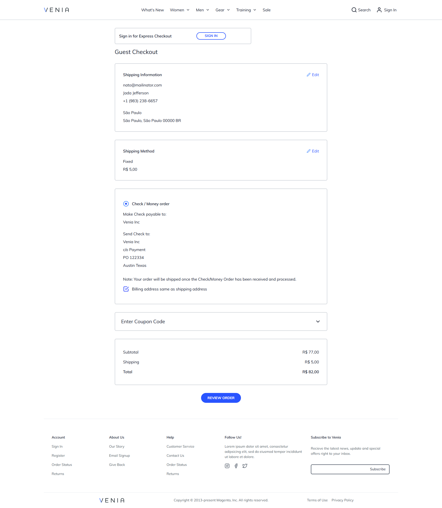

Sure! Here’s an improved version of your README with enhanced clarity and detail:

---

# PWA Studio (Venia) - One Step Checkout

This extension provides a simple one-step checkout solution for PWA Studio.

## Installation

To add the One Step Checkout module to your PWA Studio project, run:

```bash
yarn add @devgfnl/pwastudio-one-step-checkout
```

## Layouts

The extension supports three different checkout layouts:

- **3columns** - Default layout


- **2columns** - A more compact layout


- **1column** - A single-column layout for a streamlined experience


To customize the layout, you can override the configuration in the following file:

```
node_modules/@devgfnl/pwastudio-one-step-checkout/lib/talons/CheckoutPagePWAStudio/useCheckoutPWAStudio.js
```

Alternatively, if you prefer to manage layouts via the admin panel, you can install the optional Magento 2 module. For more details on configuring layouts from the Magento 2 admin panel, visit: [Magento 2 One Step Checkout Module](https://github.com/GabrielFNLima/magento2-one-step-checkout-pwastudio).
